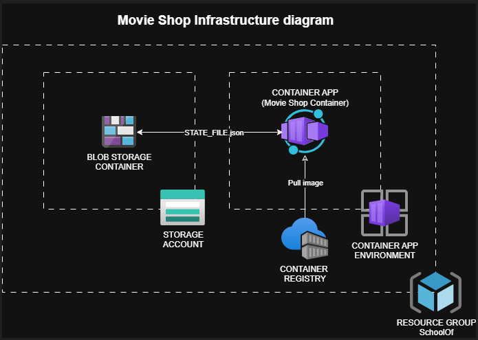

# 🎬 Movie Shop API — FastAPI + Pytest + Docker + Azure DevOps + Terraform

<br>

## 🧠 Overview

This project was developed as part of the **School of Software Engineering (Endava – Uruguay)** training program. The goal was to design and implement a complete **RESTful API** using **FastAPI** to manage a fictional *movie rental franchise* (Vintage Movie Shop), following clean coding practices, data modeling, test automation, containerization, and DevOps principles.

The API allows managing two main entities:
- **Shops:** represent different physical movie stores
- **Movies:** represent available movies for rent within each shop

The project demonstrates a complete software development lifecycle with modern DevOps practices, including CI/CD pipelines, infrastructure as code, and automated testing.

<br>

## 🏗️ Project Architecture

```
fg_mg_movie_shop/
├── movie_shop_backend/          # Core FastAPI application
│   ├── src/                     # Application source code
│   │   ├── main.py              # FastAPI app entry point
│   │   ├── routes/              # API endpoints
│   │   ├── schemas/             # Pydantic models
│   │   ├── database_manager/    # JSON persistence layer
│   │   └── constants.py         # Global constants
│   ├── app_state.json           # Local JSON database
│   ├── pyproject.toml           # UV + project dependencies
│   └── uv.lock                  # Dependency lock file
│
├── movie_shop_data/             # Docker volume for data persistence
│   └── app_state.json           # (Generated when containerized API runs)
│
├── testing/                     # Automated testing framework
│   ├── src/                     # Pytest test cases
│   ├── reports/                 # HTML test reports
│   ├── pytest.ini               # Pytest configuration
│   ├── requirements.txt         # Testing dependencies
│   └── HandsOn.md               # Testing documentation
│
├── azure-pipelines.yml          # CI/CD pipeline configuration
├── Dockerfile                   # Locally containerized API with data persistence
├── Dockerfile.ci                # CI/CD containerization for Azure DevOps usage
├── .dockerignore                # Docker build optimization
└── .gitignore                   # Git ignore rules
```

<br>

## 🚀 Quick Start

### Prerequisites
- Python 3.12+
- UV package manager
- Docker (for containerization)

### 1️⃣ Local Development Setup

```bash
# Clone the repository (ssh)
git clone git@github.com:codenamecoffee/Movie_Shop_Azure_Devops.git 
cd your_repository

# Install dependencies using UV
cd movie_shop_backend
uv sync

# Activate virtual environment
source .venv/bin/activate

# Run the API in development mode (Ctrl + C to end the process)
uv run fastapi dev src/main.py

# Deactivate virtual environment
deactivate
```

The API will be available at:
- **Application:** http://127.0.0.1:8000/
- **Interactive docs:** http://127.0.0.1:8000/docs

### 2️⃣ Run with Docker (Data Persistence)

```bash
# Build the Docker image
docker build -t <image-name> .

# Run with persistent data volume
docker run -d --name "<container-name>" -p 8000:8000 \
  -v "$(pwd)/movie_shop_data:/app/movie_shop_data" "<image-name>"
```

Data will persist in the `movie_shop_data/` directory even when the container is stopped or removed.

<br>

## 🧪 Testing & Quality Assurance

### Automated Testing Framework

The project includes a comprehensive testing suite built with **Pytest** and **Requests**, following a modular design pattern inspired by the Page Object Model, adapted as **Service Models** for API testing.

**Key Features:**
- ✅ Complete CRUD operation validation
- ✅ Positive and negative scenario coverage
- ✅ Response time performance checks (< 1000ms)
- ✅ Automated HTML reporting
- ✅ Environment-based configuration

### Running Tests

```bash
cd testing

# Create the virtual environment
uv venv

# Activate virtual environment
source .venv/bin/activate

# Install testing dependencies
uv pip install -r requirements.txt

# Generate HTML reports
pytest --html=reports/test_report.html --self-contained-html

# Run specific test categories (Same for 'negative' marker)
pytest -m smoke

# Generate HTML reports

# Deactivate virtual environment
deactivate
```

**Test Reports:** You can choose where to store the generated reports. The shown location it's just an example.

<br>

## 🐳 Containerization & DevOps

### Docker Implementation

The project includes two Dockerfile configurations:

- **`Dockerfile`:** For local development with data persistence
- **`Dockerfile.ci`:** Optimized for CI/CD pipelines with security hardening

**Data Persistence:** Uses Docker volumes to maintain application state outside container lifecycle.

### CI/CD Pipeline

The project implements a complete CI/CD pipeline using **Azure DevOps** with the following stages:

1. **Checkout:** Source code retrieval
2. **Build:** Docker image creation and artifact packaging
3. **Test:** Automated testing execution within containers
4. **Release:** Image publishing to Azure Container Registry
5. **Deploy:** Application deployment to Azure Container Apps

**Pipeline Features:**
- ✅ Multi-stage dependency management
- ✅ Automated testing integration
- ✅ Docker image optimization with artifact caching
- ✅ Fail-fast error handling
- ✅ Azure Container Apps deployment

<br>

## ☁️ Infrastructure & Deployment

### Azure Cloud Architecture

The application is deployed on **Azure Container Apps** with the following infrastructure:




<br>

### Infrastructure as Code (Terraform)

The infrastructure is managed through **two separate repositories**:

1. **Terraform Module Repository:** Reusable module for Azure Container App deployment
2. **Infrastructure Repository:** Consumes the module and manages all Azure resources

**Managed Resources:**
- Azure Container App Environment
- Azure Container Registry
- Azure Storage Account with Blob Container
- Application networking and security configurations

<br>

## 📋 Development Workflow

This project was developed through **4 main phases**, each in dedicated branches:

### Phase 1: API Development (`develop` branch)
- ✅ FastAPI application design and implementation
- ✅ RESTful endpoints for Movies and Shops management
- ✅ JSON-based persistence layer
- ✅ Pydantic data validation
- ✅ Pull Request workflow to `main`

### Phase 2: Test Automation (`testing` branch)
- ✅ Test case documentation in TestRail (no longer available since it was a free-trial)
- ✅ Pytest framework implementation
- ✅ Service model architecture for API testing
- ✅ Request/Response model creation
- ✅ Pull Request with generated test passing reports and professional tester review

### Phase 3: Containerization (`devops` branch)
- ✅ Docker implementation for local development
- ✅ Data persistence through volume mounting
- ✅ Container optimization and security
- ✅ Multi-environment support
- ✅ Local merge to main branch completed

### Phase 4: CI/CD & Infrastructure (`ci-cd` branch)
- ✅ Azure DevOps pipeline creation
- ✅ Pull Request with automated pipeline validation
- ✅ Terraform module development (separate repo)
- ✅ Infrastructure provisioning (separate repo)
- ✅ Automated deployment during PR process
- ✅ End-to-end DevOps workflow

<br>

## 🛠️ Technology Stack

| Layer | Technologies |
|-------|-------------|
| **Backend API** | FastAPI, Python 3.12, Pydantic, UV |
| **Testing** | Pytest, Requests, Python-dotenv |
| **Containerization** | Docker, Docker Compose |
| **CI/CD** | Azure DevOps, Azure Pipelines |
| **Infrastructure** | Terraform, Azure Container Apps, Azure Container Registry |
| **Storage** | JSON files, Azure Blob Storage |
| **Development** | Git, VS Code, Black, Flake8 |

<br>

## 🎓 Learning Outcomes

This project demonstrates proficiency in:

- ✅ **API Development:** RESTful design, data modeling, validation
- ✅ **Test Automation:** Comprehensive testing strategies, CI integration
- ✅ **Containerization:** Docker best practices, data persistence
- ✅ **DevOps:** CI/CD pipelines, automated deployments
- ✅ **Infrastructure:** Infrastructure as Code, cloud architecture
- ✅ **Collaboration:** Git workflows, Pull Request processes

<br>

## 👥 Authors

- **Federico González** ([codenamecoffee](https://github.com/codenamecoffee))
- **Mariana Guerra** ([MarianaGuerraC](https://github.com/MarianaGuerraC))

<br>

## 📄 License

This project is for educational purposes as part of the **School of Software Engineering** program. For more information, see `testing/LICENSE.txt`.

<br>

## 🔗 Related Repositories

This project is part of a multi-repository solution:

1. **Movie Shop API** (this repository) - Main application and CI/CD
2. **Terraform Module** - Reusable Azure Container App module *(Coming soon)*
3. **Infrastructure Repository** - Complete Azure infrastructure management *(Coming soon)*

> **Note:** The Terraform repositories contain Azure-specific configurations and are primarily for educational demonstration of Infrastructure as Code practices.

<!-- TODO: Add repository links when published:
- Terraform Module: [Add URL here]
- Infrastructure Repo: [Add URL here]
-->